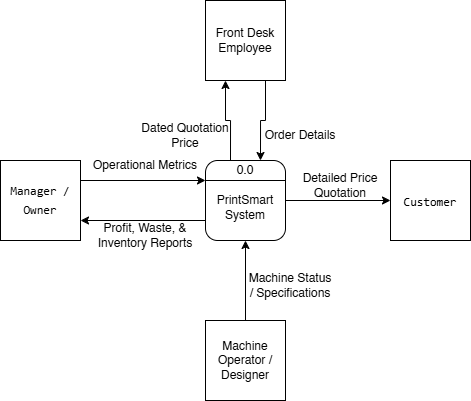
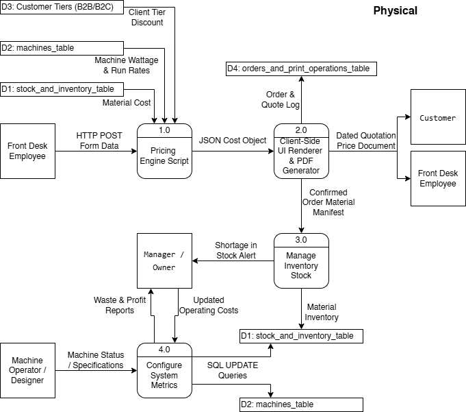
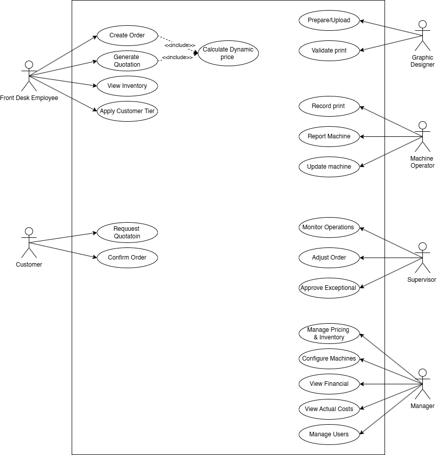
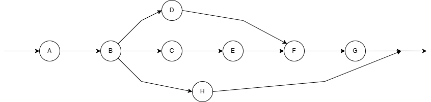

# PrintSmart: Unified Print Estimation & Inventory System 🖨️📊

Welcome to the **PrintSmart** System Architecture repository. This project is a comprehensive Case Study and System Design documentation for a modern, automated print shop management system.

## 📌 Project Overview
Print shops often suffer from manual calculation bottlenecks, reliance on static pricing sheets, and untracked inventory waste. **PrintSmart** is designed to digitize and automate these core processes. It features a dynamic pricing engine, tiered B2B/B2C logic, and real-time inventory deduction using Role-Based Access Control (RBAC).

## 📂 Repository Structure
- **`/docs`**: Contains the detailed project phases (Phase 1, 2, and 3) covering the System Proposal, PERT/Gantt analysis, and full architectural documentation in PDF format.
- **`/diagrams`**: Contains all high-resolution system models (DFDs, Use Cases, Network Diagrams).

## 🛠️ Methodology (Water-Scrum-Fall)
We adopted a **Hybrid SDLC Methodology**. Project management and budgeting were handled using structured Waterfall principles, while the core logical components (pricing algorithms) were engineered using agile, iterative Scrum practices.

---

## 📐 System Architecture & Modeling

### 1. Business Logic (Context & Logical DFD)
The system boundary and internal business processes were modeled to ensure zero managerial bottleneck for front-desk employees.
*(Showing the Context Diagram)*

  
   

### 2. Physical Implementation (Physical DFD)
Bridging the gap between business logic and software engineering, the physical DFD maps out HTTP POST payloads, JSON objects, and SQL Update queries.

  
   

### 3. Behavioral Modeling (UML Use Case)
Illustrates the Object-Oriented design principles and Role-Based Access Control (RBAC), ensuring sensitive financial metrics remain hidden from non-administrative staff.

  
   

### 4. Project Management (PERT & Gantt)
Task dependencies, critical path (27 weeks), and parallel execution schedules were calculated using Three-Point Estimation.

  
   

  
   

---

## 👥 The Development Team
This architecture was designed and documented by:
- **Joud Kayyali** (Team Lead) - [Portfolio/Website](https://joudkayyali.vercel.app/)
- **Ibraheem Abdullah** - [Portfolio/Linkedln](https://www.linkedin.com/in/ibraheem-abdullah)
- **Zaid Alassaf**
- **Hamzah Altoom**
